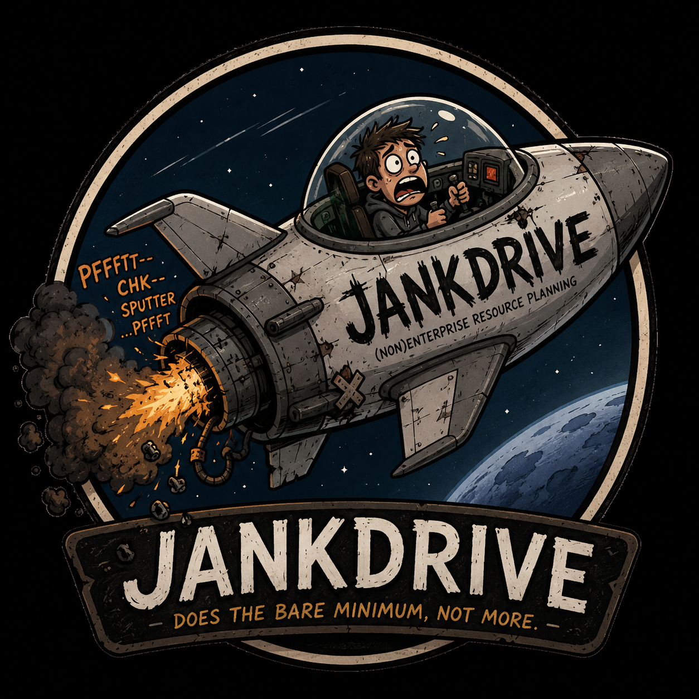

# Micro ERP



## (non)Enterprise Resource Planning

Just a tiny simple app for resource planning, prioritization and basic expense tracking. Does the bare minimum, not more.

Called Jankdrive, named after SpaceX warpdrive, which has little to nothing in common, except the name, which is where the similarities end.

You can think of it as that junkyard car you bought. It has an engine which works, but the transmission blew up so you have to push it to your destination.

## Features

* Projects & task tracking
* Gantt chart
* Basic expense tracking with tax metadata storage (not audit grade, again switch to something proper)
* Project-scoped customer conversation tracking (not a CRM. More a "write down what customers said before you forget" feature)
* Heuristic-based auto-prioritization (though low key it's just meh rn)
* Rocket man freaking out as he gets hurled in every single direction

## Public cluster

I have this app deployed to a public facing server. Before you get access, understand the following:

1. No data protection guarantees
  * Your data may be seen/inspected
  * Database might blow up
  * Database might get hacked
  * We do *nothing* to stop that
2. App is bleeding edge: things may break without warning
3. Database is currently *not* backed up. Still identifying how to make that work but there will be minumum effort towards that for the next month.

Signup is gated behind a signup code because I enjoy having at least some control over my infrastructure. If you want access, please email me, and include
an agreement of the terms listed above in this section. My email is in my GitHub, so do a bit of scoping before you raise a ticket (bots be wildin' these days)

If I decide to give you access, you will be given access to a URL and a signup code.

**Alternatively, just deploy it yourself. Again, I'm not your mom.**

## Anti-features

* User signed into the platform owns projects. Projects cannot be shared across users. If you're building a startup, you gotta share the account creds.
* Password reset & stuff - yeah doesn't exist.
  * It's 2026, just *don't* forget your username and passwordd
  * Use a password manager, Bob
  * And yeah no way for us to effectively recover your account if that happens
* No emails or notifications or anything. We're not your mom.
* Dark theme. **THERE WILL BE NO DARK THEME.**

## Design Goal

I'm building a startup and just needed a simple tool to track, prioritize and optimize work for me. So this idea was born.

This app isn't meant to be a startup, replace SAP or solve world hunger. It's kinda like Hinge where it's "*designed to be deleted*", but unlike Hinge
where it actually gets deleted.

This does the bare minimum and is probably perfect for pre-seed / pre-idea / pre-"founder was born" startups. Need more features? Use something proper
like Jira, SAP, Odoo, or literally anything else.

## Running locally

This is a Next.js, Drizzle, and Postgres app. Postgres is managed by Docker
Compose and is bound to `127.0.0.1` only so it is not exposed on a public
interface.

```sh
npm install
docker compose up -d postgres
npm run db:migrate
npm run dev -- --hostname 127.0.0.1 --port 3000
```

Copy `.env.example` to `.env` and set strong values for:

- `DATABASE_URL`
- `AUTH_SECRET`
- `SIGNUP_CODE`

On this dev target, `.env` has been generated locally and is ignored by git.
The app should stay bound to localhost unless it is placed behind a properly
secured tunnel or reverse proxy.

Accounts are created through `/signup`. Signup requires `SIGNUP_CODE`, which
keeps a public dev target from becoming an open registration endpoint.

## Scripts

- `npm run dev` starts the Next.js dev server.
- `npm run build` creates a production build.
- `npm run lint` runs ESLint.
- `npm run test` runs Vitest.
- `npm run db:migrate` applies Drizzle migrations.
- `npm run preview` builds and previews the app in Cloudflare's Workers runtime.
- `npm run deploy` builds and deploys the app to Cloudflare Workers.

## Deploying to k8s

* There's a deploy/prod.yaml k8s config file. Apply it to k8s with a bit of modification and it should come to life.
* `deploy/prod.yaml`: update the ingress config, update the host or smtn. delete the cert manager / SSL
* enjoy

**Note**: a signup code is required to sign up. Since all secrets are randomly generated by k8s (yes, i'm a cybersecurity engineer so you can be rest assured this code is decently secure), you'll need to get the `SIGNUP_CODE` secret from `microerp-secrets`. Alternatively, you can update `prod.yaml` with a hardcoded string. Do what floats your boat.

## Redeploying to k3d (low key my own notes for my own cluster)

```bash
k3d_context=urmom
kube_context="urmom"

kubectl config use-context ${k3d_context}

# build/import image
docker build -t jankdrive:latest .
k3d image import jankdrive:latest -c ${k3d_context}

# delete old migration job
kubectl --context ${kube_context} -n microerp delete job microerp-migrate --ignore-not-found

# set up new job
kubectl --context ${kube_context} apply -f deploy/prod.yaml

# roll out new pods (chatgpt recommended this but I think the rest of the steps can be skipped)
kubectl --context ${kube_context} -n microerp rollout restart deploy/microerp-web
kubectl --context ${kube_context} -n microerp rollout status deploy/microerp-web

# wait for migrations to happen
kubectl --context ${kube_context} -n microerp wait --for=condition=complete job/microerp-migrate --timeout=120s
kubectl --context ${kube_context} -n microerp logs job/microerp-migrate

# get logs n stuff
kubectl --context ${kube_context} -n microerp get pods,jobs,ingress,certificate
```

## Maintained docs

Future agents and humans should use these instead of trusting old README design notes:

- [`docs/architecture.md`](docs/architecture.md): app shape, module map, routes, invariants, and non-goals.
- [`docs/data-model.md`](docs/data-model.md): tables, relationships, statuses, lifecycle rules, and schema quirks.
- [`docs/implementation-notes.md`](docs/implementation-notes.md): current decisions, sharp edges, migrations, and where to inspect first.
- [`docs/deploy-kubernetes.md`](docs/deploy-kubernetes.md): notes for the single-server Kubernetes deployment.

## Cloudflare deployment

This app is configured for Cloudflare Workers via the OpenNext Cloudflare
adapter. Pages is not the right target for this full-stack SSR app.

For production Postgres, create a Cloudflare Hyperdrive config for your
database and add its ID to `wrangler.jsonc` under the commented `hyperdrive`
binding. The app will use `HYPERDRIVE.connectionString` when that binding is
present, and `DATABASE_URL` otherwise.

Set production secrets before deploying:

```sh
npx wrangler secret put AUTH_SECRET
npx wrangler secret put SIGNUP_CODE
```

If not using Hyperdrive, also set:

```sh
npx wrangler secret put DATABASE_URL
```

Then deploy:

```sh
npm run deploy
```

## Kubernetes deployment

For the single-server Kubernetes deployment at
`jankdrive.apps.dev.devya.sh`, see
[`docs/deploy-kubernetes.md`](docs/deploy-kubernetes.md).
